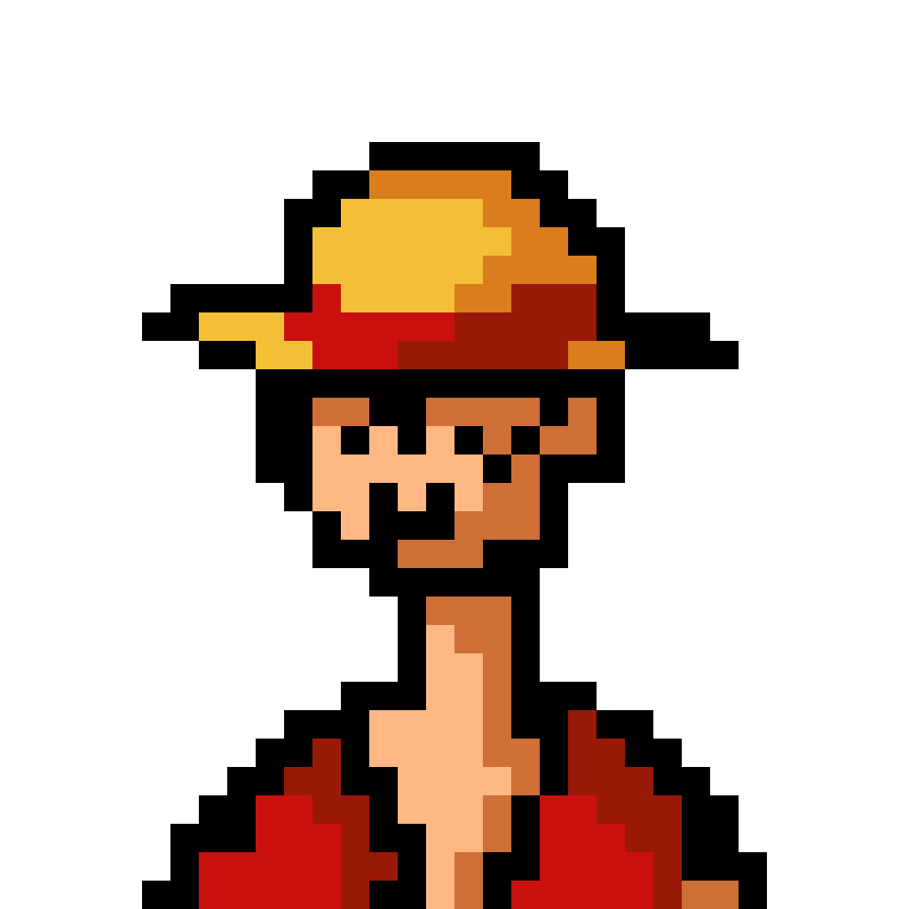

    <h1 align="left">Hello! My name is Lorenzo </h1>
    

## Portfolio Site

- 🤷🏾‍♂️ **[Portfolio](lorenzotaylor.com)** - My personal site

## Current Projects

- 🔄 **[Coming Soon](https://www.google.com/search?q=bongo+cat+gif&sca_esv=d2a5470d2e85f15e&udm=2&biw=1440&bih=669&sxsrf=ANbL-n64BLMLsTVSpgZ3gtQ3vorpcsz2Tw%3A1775865501362&ei=nY7ZabfmFfec0PEPurjk0Qg&oq=bongo+cat&gs_lp=Egtnd3Mtd2l6LWltZyIJYm9uZ28gY2F0KgIIATINEAAYgAQYsQMYQxiKBTIKEAAYgAQYQxiKBTIIEAAYgAQYsQMyBhAAGAcYHjIFEAAYgAQyBRAAGIAEMgYQABgHGB4yChAAGIAEGEMYigUyBRAAGIAEMgoQABiABBhDGIoFSOYIUABYAHABeACQAQCYAQCgAQCqAQC4AQHIAQCYAgGgAguYAwCIBgGSBwExoAcAsgcAuAcAwgcDMy0xyAcJgAgA&sclient=gws-wiz-img#sv=CAMSVhoyKhBlLTFzcUR4aUdEYXBRZkdNMg4xc3FEeGlHRGFwUWZHTToOVVBrTDhDQUNtX0hoLU0gBCocCgZtb3NhaWMSEGUtMXNxRHhpR0RhcFFmR00YADABGAcglvCI2QxKCBABGAEgASgB)** - Ai native interview VM's
- 👾 **[GitGarden](https://trygitgarden.com)** - Pixel art characters for your Github stats

### Legacy Work
- 💳 **[Renumerate](https://renumerate.com)** - Retention on autopilot
- 👴🏻 **[Herewith](https://herewith.com)** - Taskrabbit for the elderly

 
<h2 align="left">🌟 Languages & Tools I Enjoy Using</h2>

 

