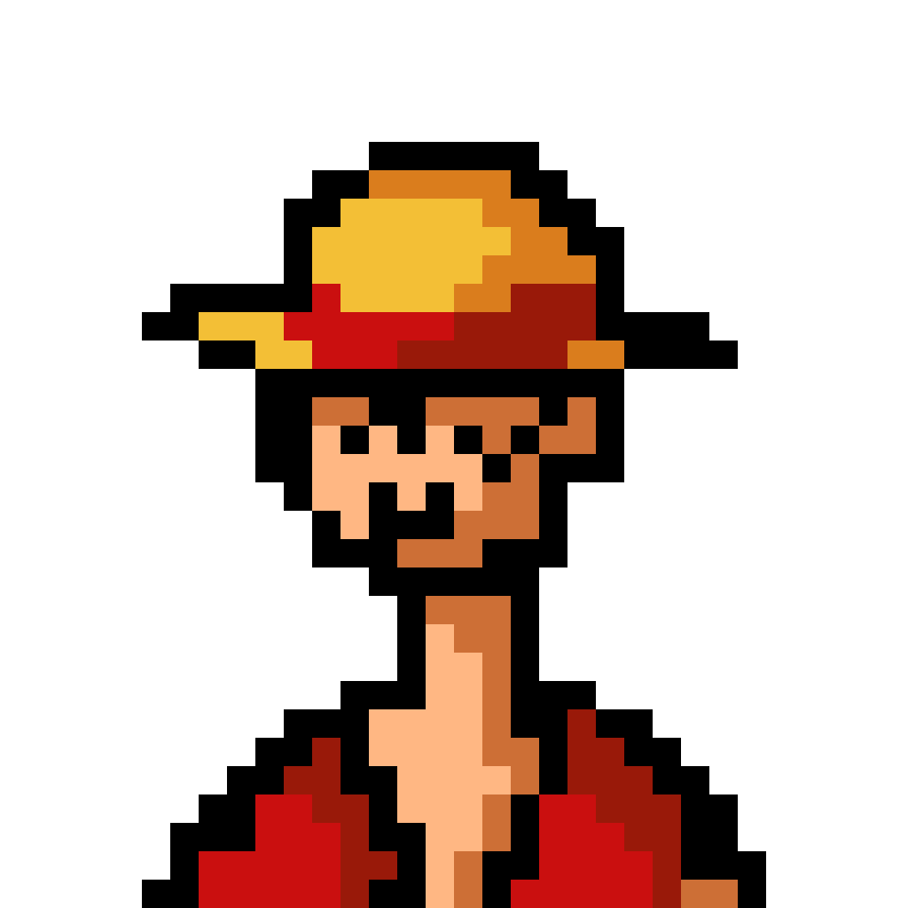

    <h1 align="left">Lorenzo Taylor</h1>
    

**`Web Development Enthusiast [Full Stack Developer|AI]`**

Hello! My name is Lorenzo

For more information and live demos of my projects youre welcome to visit my <a href="https://www.lorenzotaylor.com/" target="_blank">portfolio website.</a>

    
    

 
<h2 align="left">🌟 Languages & Tools I Enjoy Using</h2>

    
    
    
    
    
    
    
    
    

 
<h2 align="left">📊 GitHub Stats</h2>

    
    

 
 

<h2 align="left">🧰 Most used Languages</h2>

